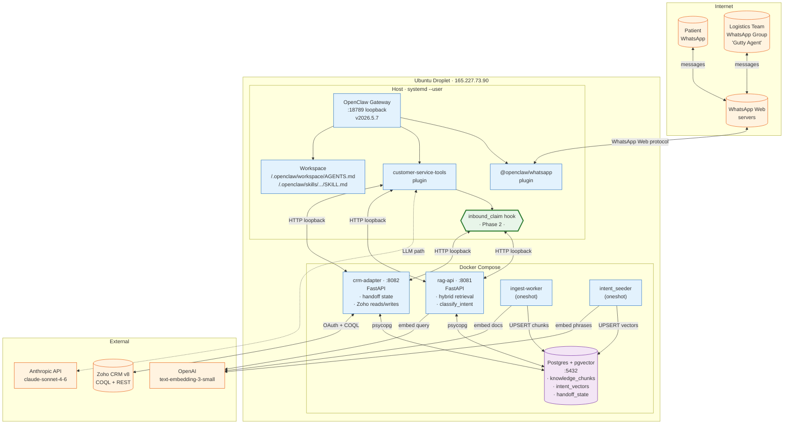
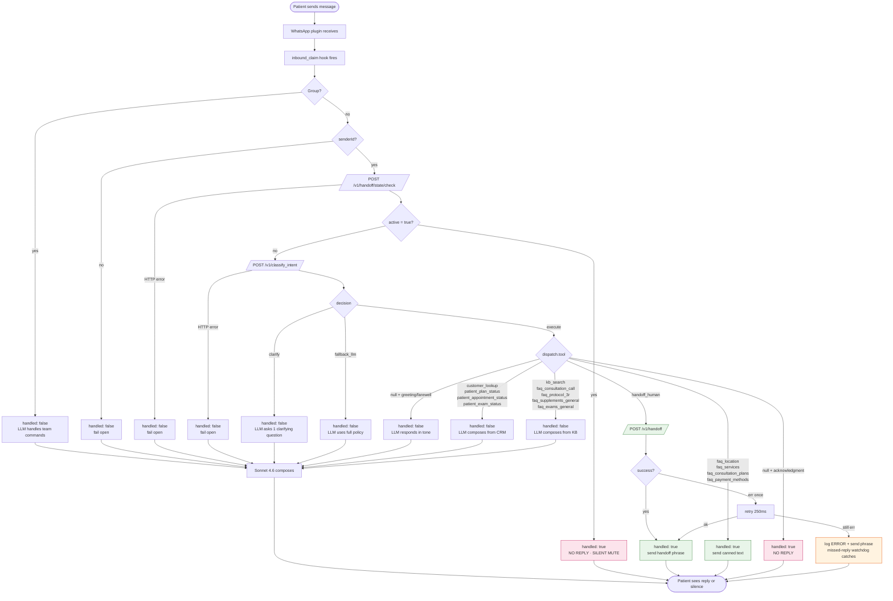
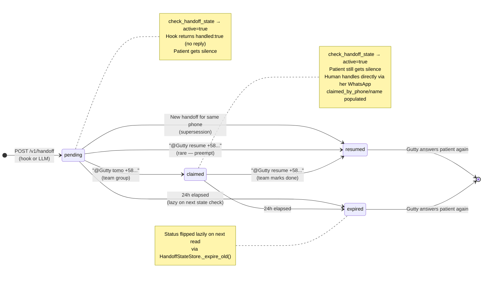
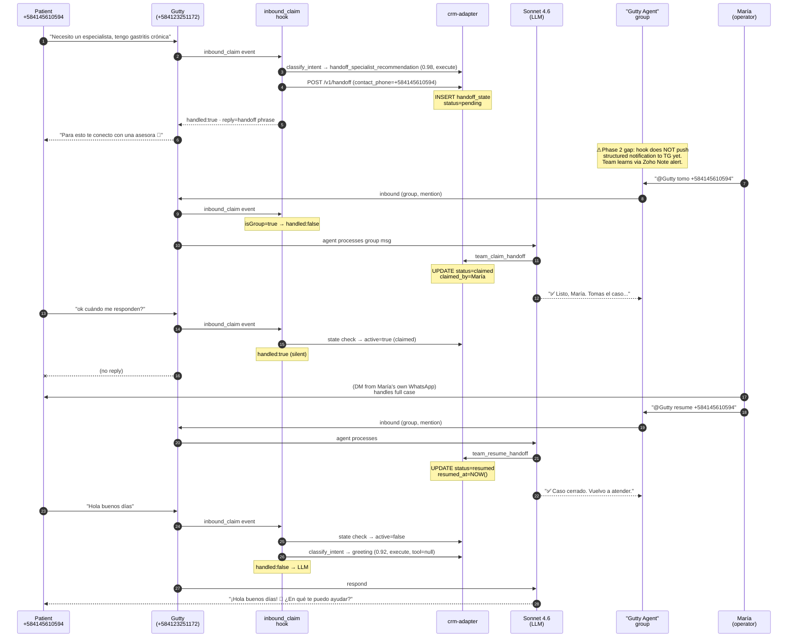
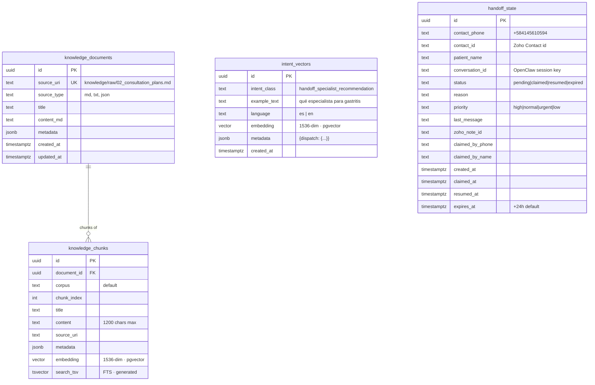
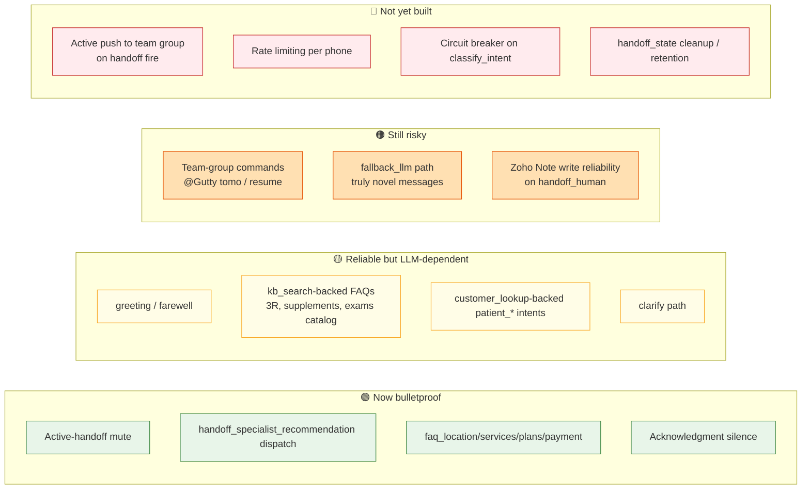
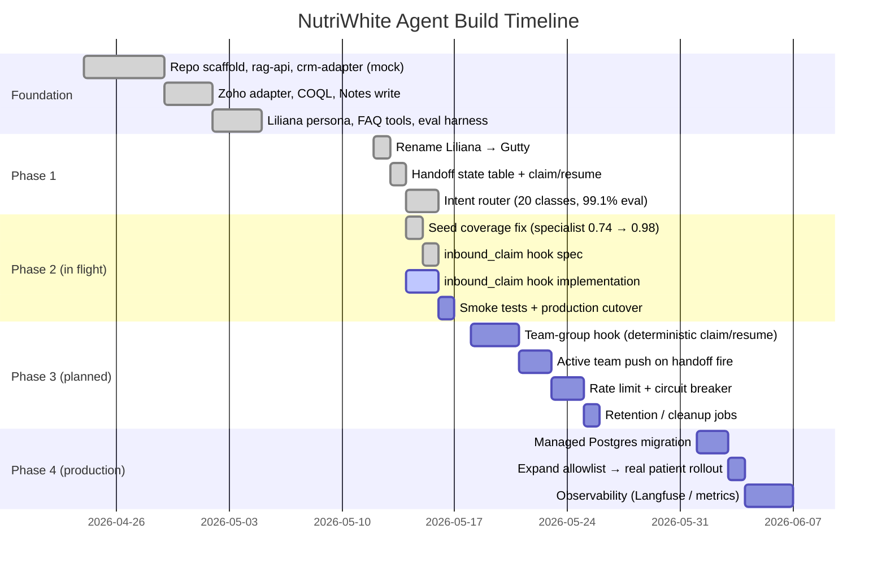

# NutriWhite Agent — Architecture Diagrams

Visual reference for the Gutty WhatsApp agent stack. Renders inline in GitHub. Each diagram is followed by a "what this reveals" commentary so you can spot weak spots and future upgrades.

Last reviewed: 2026-05-14, after Phase 1 (intent router) shipped and Phase 2 (deterministic inbound_claim hook) planned.

---

## 1. System overview — services and where they run

### What this reveals

- **Three trust zones.** Internet → Droplet (only WhatsApp Web traffic) → Loopback (all internal HTTP on 127.0.0.1). No service is publicly exposed except OpenClaw's WhatsApp listener.
- **Single droplet, single failure domain.** Postgres, the agent, and the gateway all live on the same box. Disk loss = everything. **Upgrade target:** managed Postgres on DigitalOcean before any real patient traffic.
- **Two external dependencies on the hot path:** Anthropic (only when LLM fallback path triggers) and OpenAI (every classify call). OpenAI outage = classifier fails → hook falls open to LLM → potentially worse behavior. **Upgrade target:** cache the embedding for repeat queries (5-10 min TTL) to absorb brief outages.
- **Zoho is on the hot path for handoffs** but reads are COQL (slow). **Upgrade target:** lazy-write Notes async so the patient-facing handoff reply isn't blocked on Zoho latency.

---

## 2. Inbound message decision tree — the critical flow

### What this reveals

- **Three deterministic exits, six LLM exits.** Roughly: handoffs + canned FAQs + active mute + acknowledgment skip the LLM. Greetings, KB-backed FAQs, patient-specific lookups, and ambiguous routing still need it.
- **Fail-open everywhere.** Every HTTP error from the hook falls through to the LLM. Good for availability. Bad for cost spikes if RAG or CRM is sick. **Upgrade target:** circuit breaker — if classify_intent has failed N times in M seconds, return a static "tengo un problema técnico, te conecto con asesora" instead of LLM fallback.
- **The retry on /v1/handoff is the only retry in the system.** Every other HTTP call is single-shot. **Upgrade target:** small retry budget on the classify call too — current "fail open" is too aggressive for transient errors.
- **No rate limiting at the hook layer.** A patient spamming 100 messages incurs 100 classify calls and 100 potential LLM calls. **Upgrade target:** per-phone token bucket (e.g. 5 messages / 60s) at the hook entry.

---

## 3. Handoff lifecycle — state machine

### What this reveals

- **Two ways to leave the active state:** explicit resume or 24h timeout. The 24h fallback is the safety net so a forgotten claim doesn't permanently mute a patient.
- **No "escalated" path.** If the team can't reach a patient and wants to mark the case unresolved, current options are limited — claim then leave it to expire, or resume manually. **Upgrade target:** add a `failed` terminal state plus a `team_close_handoff` tool with optional reason.
- **No claim history.** Resuming clears `claimed_by_*` fields on the next pending row, but we can see past handoffs by querying `WHERE status='resumed'`. **Upgrade target:** keep a small audit table per claim if reporting needs it; otherwise the current single-row-per-handoff design is fine for v1.
- **Supersession is silent.** A new handoff for the same phone resumes the prior one without notifying the original claimer. **Upgrade target:** if a claimed handoff is superseded, ping the claimer in the team group so they know the case state changed.

---

## 4. Team group command flow — claim and resume

### What this reveals

- **The TEAM side still depends on the LLM.** Step 7–10 (María's `@Gutty tomo` command) goes through the agent loop. Same reliability problem we just solved for patients. **Upgrade target:** detect team-group commands in the hook (`isGroup && content.startsWith('@Gutty tomo|resume')`) and call the team-claim/resume endpoint directly without invoking the LLM at all.
- **No active notification of the team on handoff.** Step 4-6 fires but the operators only learn through a Zoho Note (which requires watching the CRM) or out-of-band channels. **Upgrade target:** the hook should POST to OpenClaw's outbound send API to push a structured message into the team group on every handoff. Blocked on discovering the send-to-JID method — the build agent flagged this as Phase 2 follow-up.
- **The team must @-mention Gutty.** If María just writes "tomo el caso" without `@Gutty`, OpenClaw's `requireMention: true` policy drops it. **Possible upgrade:** auto-treat any team-group message from one of the known operator phone numbers as targeted, regardless of mention.

---

## 5. Data model — what lives where

Plus what does NOT live in Postgres:

| Data | Lives in | Why |
|---|---|---|
| Customer profile (Contacts) | Zoho CRM | System of record for patient identity |
| Deals / plans (Tratos) | Zoho CRM | Sales pipeline lives there |
| Consultas | Zoho custom module | Operational calendar |
| Exámenes | Zoho custom module | Lab results live there |
| Handoff Notes | Zoho Contacts.Notes | Audit trail / human-readable history |
| Message journal | JSONL on disk `/root/nw-agent/runtime/openclaw-message-journal.jsonl` | Watchdog for missed replies |
| OpenClaw session state | `~/.openclaw/agents/nw-cs-agent/sessions/sessions.json` | Per-conversation continuity |
| OpenClaw config | `~/.openclaw/openclaw.json` | Channel auth, model, plugin config |

### What this reveals

- **Zero PII in Postgres beyond phone number + name.** Everything sensitive (full patient record, financial data, exam results) lives in Zoho. Postgres is operational state.
- **No retention policy on handoff_state.** Rows accumulate forever (currently a handful, but at scale will need it). **Upgrade target:** add a `cleanup` cron that hard-deletes `status IN ('resumed', 'expired')` rows older than 90 days.
- **No index on `handoff_state.contact_id`.** Lookups by Zoho contact ID would do a seq scan. Not currently used but worth adding before any tool calls this path.
- **The message journal is on the host filesystem.** Disk crash = lost watchdog history. Acceptable for now; **upgrade target:** ship to S3/Spaces.

---

## 6. Tool registration map — what the agent can call

| Tool | Backend | Called by hook | Called by LLM | Determinism |
|---|---|:-:|:-:|---|
| `check_handoff_state` | crm-adapter `/v1/handoff/state/check` | ✓ first | (redundant) | 100% |
| `classify_intent` | rag-api `/v1/classify_intent` | ✓ second | (redundant) | 100% |
| `handoff_human` | crm-adapter `/v1/handoff` | ✓ on execute+specialist/etc. | only if hook falls open | 100% on hook path |
| `faq_location` | inline canned (DIRECT_FAQ_REPLIES) | ✓ on execute | rare | 100% on hook path |
| `faq_services` | inline canned | ✓ on execute | rare | 100% on hook path |
| `faq_consultation_plans` | inline canned | ✓ on execute | rare | 100% on hook path |
| `faq_payment_methods` | inline canned | ✓ on execute | rare | 100% on hook path |
| `faq_consultation_call` | kb_search via classify dispatch | LLM only | ✓ | LLM-dependent |
| `faq_protocol_3r` | kb_search | LLM only | ✓ | LLM-dependent |
| `faq_supplements_general` | kb_search | LLM only | ✓ | LLM-dependent |
| `faq_exams_general` | kb_search | LLM only | ✓ | LLM-dependent |
| `kb_search` | rag-api `/v1/retrieve` | — | ✓ | LLM-dependent |
| `customer_lookup` | crm-adapter `/v1/customer/profile` | — | ✓ | LLM-dependent |
| `customer_orders` | crm-adapter `/v1/customer/orders` | — | ✓ | LLM-dependent |
| `customer_consultas` | crm-adapter `/v1/customer/tickets` | — | ✓ | LLM-dependent |
| `customer_examenes` | crm-adapter `/v1/customer/examenes` | — | ✓ | LLM-dependent |
| `team_claim_handoff` | crm-adapter `/v1/handoff/claim` | — | ✓ | LLM-dependent |
| `team_resume_handoff` | crm-adapter `/v1/handoff/resume` | — | ✓ | LLM-dependent |
| `ticket_create_draft` | crm-adapter `/v1/tickets/draft` | — | ✓ | LLM-dependent |

### What this reveals

- **Roughly 50/50 split** between deterministic (hook) and probabilistic (LLM) paths. The LLM still owns a lot of the surface area.
- **Team commands are LLM-dependent.** Same reliability risk as patient handoff was, pre-hook. Worth moving to the hook in a follow-up.
- **Patient-specific lookups (`customer_*`) are all LLM-dependent.** Acceptable because they require composition — the LLM is genuinely useful for "respond about your plan in Gutty's voice." Determinizing these would require templating per-intent.

---

## 7. Where reliability fails today — known gaps

### Triage

**Immediate (next sprint, after Phase 2 ships):**
- 🟠 C1 — extend the hook to handle team-group commands deterministically too.
- 🔴 D1 — discover OpenClaw's send-to-JID API; if found, push handoff notifications to the team group from the hook.

**Soon (next month):**
- 🔴 D4 — add a small daily cleanup job for `handoff_state` rows older than 90 days.
- 🟠 C3 — make Zoho Note creation async / fire-and-forget so it doesn't block the patient reply.

**Operational hardening (before scale):**
- 🔴 D2 + D3 — per-phone rate limit and circuit breaker.
- Move Postgres off the droplet (managed instance).
- Move WhatsApp allowlist from single tester (`+584241329676`) to production rollout with team + early-access patients.

---

## 8. Phase summary — where we've been, where we're going

---

## How to read this doc

- **Diagrams 1-2** describe the architecture as planned post-Phase-2 — what you'll see after the inbound_claim hook ships.
- **Diagrams 3-5** describe state and data flow that's already in place today.
- **Diagrams 6-7** are the honest scorecard. What's solid, what's still LLM-dependent, what's a known gap.
- **Diagram 8** is the rough timeline so you can see what we've burnt and what's left.

Use this doc when:
- A new collaborator needs to understand the system without reading the whole repo.
- You're deciding whether to take on an upgrade — find it in §7 to see priority.
- Something breaks in production — §2 is the decision tree to walk through.
- You want to spot architectural smells — read the "What this reveals" blocks under each diagram.
